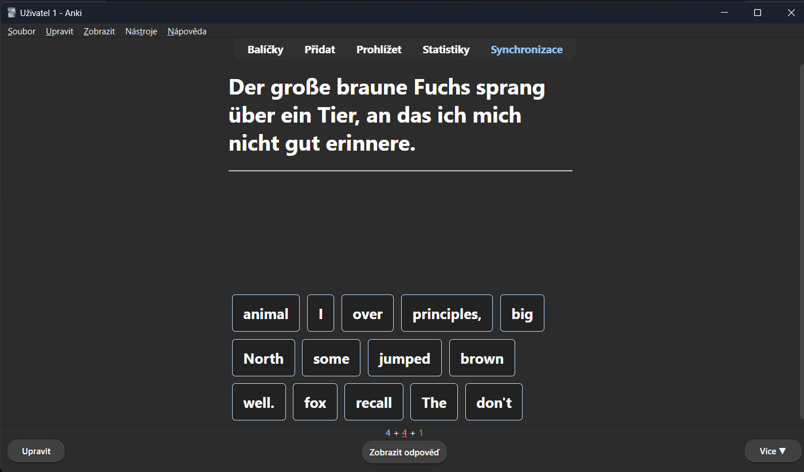
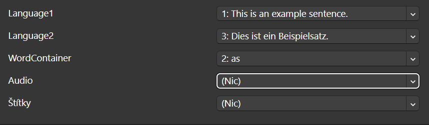

# Anki-Duolingo Card Generator
User @Present-Boat-2053 made a brilliant card type, which looks like a Duolingo fill-in exercise! But making these cards can be complicated and take a long time, because you need many of them, therefore I decided to make a Python program to translate them for you and generate the complementary words as well!

## Usage
``python generator.py {source-language} {target-language} {source-file}``

e.g. ``python generator.py en de sample/english.txt``

> [!NOTE]
> The sample folder contains English and Czech sentences as generated by ChatGPT so you can try it out, I recommend ChatGPT for the generation, I did not bake the API in because it's not free :(

## Currently supported languages
English (``en``), German (``de``), Czech (``cs``)

More coming soon! It's just a matter of adding the wordmaps for the word generation algorithm, basically copy-pasta from Wiktionary. 

## Currently supported translators
By default the ``translate`` library is used and therefore the MyMemory Translation API is utilised. You can change it to ``googletrans`` in the code, if you will, by changing the default lib argument. 

## Output
The script generates a ``.csv`` in format [Language1, WordContainerLang1, Language2, WordContainerLang2]. You can therefore generate ``en->de`` or ``de->en`` both ways just flipping the order. 

Generates ``export_{source_lang}_{target_lang}_{time}.csv`` in the export directory.

## Import into Anki
You must have [Note Type: Puzzle Sentences](https://ankiweb.net/shared/info/1522392024) installed to use the Puzzle Sentences+ notetype! (credit Present-Boat-2053)

For importing into Anki press ``Ctrl+Shift+I`` on Windows (File->Import) and use order 1-3-2 or 3-1-4:

## Requirements
- Python 3.10 and higher due to match-case pattern matching
- for libraries see requirements.txt in file directory